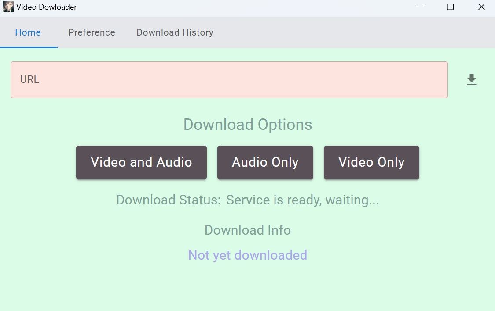

# new-video-downloader



## Overview
The **New Video Downloader** is a user-friendly application for downloading videos from popular platforms such as YouTube, X (Twitter), TikTok, and Instagram.

Built on the open-source **Cobalt** project, this tool provides a secure and reliable way to download and save videos for purposes such as editing or creating backups.

## Features
- **Multi-language Support**: Switch between **Traditional Chinese**, **English**, **Japanese**, **Korean**, and **Turkish** interfaces.
- **Local Download History**: Keeps a record of all downloaded videos stored locally, allowing users to easily track and access original video links.
- **Platform Compatibility**: Supports downloading from major platforms like YouTube, X (Twitter), TikTok, and Instagram.
- **Secure & Reliable**: Based on the open-source **Cobalt** project, ensuring transparency and safety.
- **Intuitive UI**: Built with **React** for a seamless user experience.

## How It Works
1. The API server, based on **Cobalt**, is run in a Docker container with port forwarding configured via Nginx.
2. Users interact with the API through a **React-based graphical interface**.
3. The application processes user requests, downloads the desired video, and logs the download history locally for future reference.

## How to build

### Required dependencies

- rust (recommended minimum is 1.77.2)
- node (recommended minimum is v22.1.0)

```sh
git clone https://github.com/Serori1923/new-video-downloader.git
cd new-video-downloader

# to update dependencies
npm i

# for development
npm run tauri dev

# for compiling as a release build
npm run tauri build
```

## Acknowledgments
- **[cobalt](https://github.com/imputnet/cobalt)**: The open-source library powering the core functionality.
- All contributors and the open-source community.
> Disclaimer: This tool is intended for personal use only. Please ensure compliance with the terms of service of the platforms you download content from.